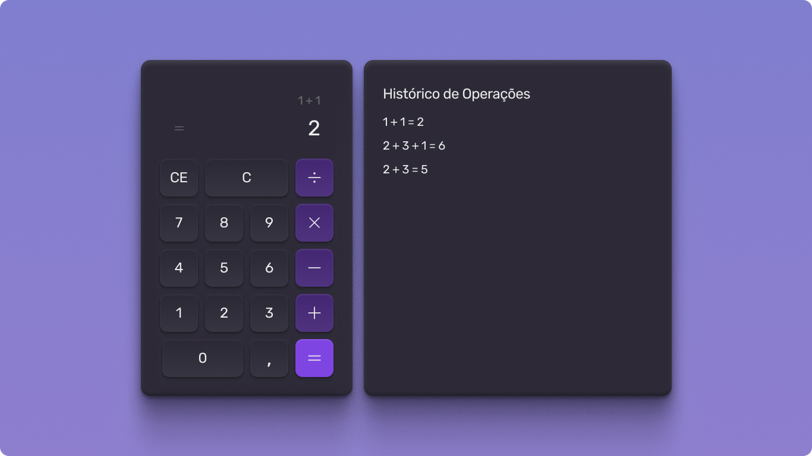

#  calculadora-ui

<p align="center">
  
  <br>  
</p>

<p align="center">
  Um projeto de estudo focado na criação de uma calculadora funcional com uma interface moderna e responsiva, utilizando React, Vite e o poder do Tailwind CSS para estilização.
</p>

<p align="center">
  <a href="https://calculadora-ui.vercel.app/">
    
  </a>
</p>

<div align="center">


</div>

## 🚀 Demonstração Online

A aplicação está disponível para teste no seguinte link:

-   **[Acessar a Calculadora](https://calculadora-ui.vercel.app/)**

## ✨ Sobre o Projeto

Este projeto vai além de uma simples calculadora visual. Foi uma oportunidade para aplicar e aprofundar conceitos intermediários e avançados do React, construindo uma aplicação robusta, funcional e com código limpo.

O principal objetivo foi estruturar a lógica da calculadora de forma eficiente, utilizando as melhores práticas do ecossistema React. Para isso, foram implementados os seguintes conceitos:

-   **Gerenciamento de Estado (`useState`)**: Para controlar em tempo real os números, o operador selecionado e o resultado exibido no display.
-   **Efeitos Colaterais (`useEffect`)**: Utilizado para reagir a mudanças nos estados, como atualizar o display ou realizar cálculos de forma consistente.
-   **Hooks Customizados**: Foi criado um hook personalizado para encapsular e reutilizar a lógica de estado da calculadora, tornando os componentes mais limpos e a lógica mais fácil de manter e testar.
-   **Context API (Providers)**: Para gerenciar o tema da aplicação (claro/escuro), permitindo que qualquer componente aninhado pudesse acessar e modificar o tema sem a necessidade de "prop drilling".
-   **Renderização de Listas**: O teclado numérico e os botões de operação foram gerados dinamicamente através da renderização de listas (`.map()`), o que torna a adição de novos botões mais simples e escalável.
-   **Estilização com Tailwind CSS**: Toda a interface foi estilizada utilizando o framework utility-first Tailwind CSS, garantindo um desenvolvimento ágil, responsivo e um design consistente.

## 🛠️ Tecnologias Utilizadas

-   **[React](https://react.dev/)**: Biblioteca JavaScript para a construção da interface de usuário baseada em componentes.
-   **[Vite](https://vitejs.dev/)**: Ferramenta de build moderna que proporciona um ambiente de desenvolvimento extremamente rápido e otimiza o empacotamento para produção.
-   **[Tailwind CSS](https://tailwindcss.com/)**: Framework CSS "utility-first" para a criação rápida de interfaces customizadas diretamente no HTML/JSX.
-   **[PostCSS](https://postcss.org/)**: Ferramenta para transformar CSS com plugins JavaScript, utilizada aqui para processar o Tailwind CSS.
-   **[JavaScript (ES6+)](https://developer.mozilla.org/pt-BR/docs/Web/JavaScript)**: Linguagem de programação principal do projeto.
-   **[Vercel](https://vercel.com/)**: Plataforma de deployment utilizada para a hospedagem e o deploy contínuo da aplicação.

## ⚙️ Como Executar o Projeto Localmente

Para rodar este projeto em sua máquina, siga os passos abaixo:

1.  **Clone o repositório:**
    ```bash
    git clone https://github.com/nikolasmarlon/calculadora-ui.git
    ```

2.  **Navegue até o diretório do projeto:**
    ```bash
    cd calculadora-ui
    ```

3.  **Instale as dependências:**
    ```bash
    npm install
    ```
    *ou, se utilizar o yarn:*
    ```bash
    yarn
    ```

4.  **Inicie o servidor de desenvolvimento:**
    ```bash
    npm run dev
    ```
    *ou:*
    ```bash
    yarn dev
    ```

5.  **Abra seu navegador:**
    Acesse `http://localhost:5173` (ou a porta que o Vite indicar no terminal) para ver a aplicação em execução.

## 📝 Licença

Este projeto está sob a licença MIT.

---
<p align="center">
  Desenvolvido por <a href="https://github.com/nikolasmarlon">Nikolas Marlon</a>
</p>